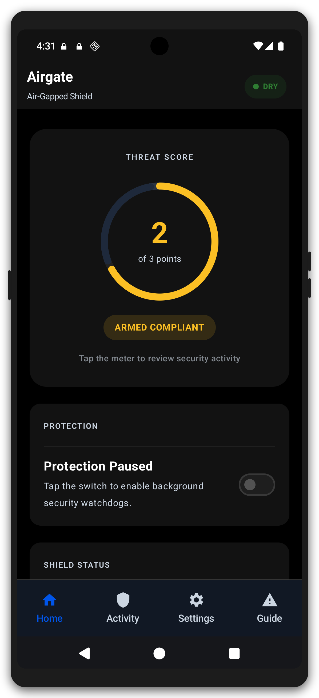

# Airgate

**Airgate** is an offline, Device-Owner-assisted watchdog designed for dedicated crypto cold-storage Android devices.

## Features

### Monitoring

- **13 violation signals** across three scoring groups — Wireless, USB, and System Tamper — each with its own trigger, response tier, and alarm/point behavior (see the [violation matrix](#violation-matrix) below).
- **Always-on watchdog** — a foreground service (`WatchdogService`) drives four detectors (network, radio state, USB, system settings). Most events are caught instantly by system broadcasts (airplane-mode flips, USB attach, time/SIM changes); the rest are audited by a 10-second background poll, which also reads the live Bluetooth and airplane-mode state so a radio that was already on (or airplane mode already off) when monitoring started is still detected.
- **Survives process death** — a 15-minute AlarmManager safety-net re-runs the full posture audit even if the service is killed.

### Threat scoring & response

- **Weighted tiered accounting** — each scoring group can claim at most one threat point per 24-hour window, so a single flapping radio cannot farm points. The persistent threat streak is measured against a configurable wipe threshold (default **3**).
- **Four response tiers** — `LOG_ONLY` (audit), `ALARM` (harden + full-screen alarm), `ALARM_STREAK` (harden + point + alarm), and `INSTANT_WIPE` (bypass the streak and wipe immediately). Self-defense failures route through the `INSTANT_WIPE` tier by default.
- **Grace countdown** — an optional grace window delays the wipe behind a countdown screen instead of wiping instantly. The countdown deadline runs on a reboot-surviving monotonic clock, so changing the system clock cannot stretch or skip it.
- **Wipe scope** — the wipe is a full factory reset, optionally including FRP (Factory Reset Protection) data. The platform's wipe APIs are fire-and-forget, so the engine tracks the honest result — `ACCEPTED` (the system took over the erase), `SIMULATED` (dry-run), or `REJECTED` — and a refused wipe returns to the alarm state and raises a "WIPE FAILED" alarm instead of silently claiming success.
- **Dry-Run mode (default ON)** — every destructive action is simulated until you deliberately go live, and turning it off requires a confirmation dialog that spells out the consequence.

### Reactive & self-defense

- **Reactive hardening** — on breach, the engine re-asserts airplane mode and re-locks the Device Owner restrictions.
- **Self-defense audit** — periodically verifies Dhizuku Device Owner authority and pins the app's own signature (hash baked into the build from the signing certificate), detecting compromise.
- **Block Debugging Features** — a single toggle governs ADB / developer-options enforcement; **USB data transfer** (MTP/PTP/ADB/accessory/MIDI/tethering/ethernet) is *always* enforced regardless of that toggle.

### App experience

- **Armed PIN lock** — PBKDF2-HMAC-SHA256 with 120,000 rounds and a per-install salt, 5-attempt lockout with exponential backoff; the same PIN guards alarm disarm, streak clearing, and settings. PIN material and settings are encrypted at rest in the Android Keystore, and lockout runs on a monotonic clock — a manual clock change cannot bypass it.
- **Arming gate** — the watchdog can only be switched on while the Armed PIN is configured and readable, the app can post notifications, and Bluetooth state can be read (BLUETOOTH_CONNECT), so a device whose alarm path could be entirely silent or whose Bluetooth detection is blind can never be armed. Disabling is always allowed.
- **Dashboard** — live threat-score hero meter, Protection master switch, and real-time Shield Status of each defense layer.
- **Security Activity** — current threat score and each active violation category with occurrence counts and reasons.
- **Violations guide** — a searchable, filterable catalogue of every detection, plus a Protection Vectors overview of the shield architecture.
- **Settings** — required-permission checker, thresholds & timers, posture/tamper alarms, hardening & wipe scope, and a one-tap dry-run simulation harness (Wi-Fi, Bluetooth, USB) that injects synthetic breaches.
- **Paranoid Mode preset** — one tap enforces the strictest posture (wipe threshold 1, 1-minute safety-net, no grace window, strictest clock-skew tolerance) and arms the watchdog.
- **100% offline** — no `INTERNET` permission; nothing ever leaves the device.

## Screenshots

The dashboard in light and dark theme. A step-by-step, picture-by-picture walkthrough of every screen lives in [`user-guide.md`](user-guide.md).




Regenerate them with `make screens`, `make screens-dark`, and `make mockups` (the app's FLAG_SECURE blocks `adb screencap`, so these use the emulator's own screenshot instead; `make mockups` wraps every screenshot in the SVG-designed Android phone frame).

## Architecture & Security Model

- **Zero Network Purity:** 100% offline application. `android.permission.INTERNET` is explicitly omitted from `AndroidManifest.xml`.
- **Dhizuku Device Owner Interop:** Executes privileged policy enforcement (`DevicePolicyManager`) via Binder calls without requiring factory resets.
- **Weighted Tiered Accounting:** Monitors 13 multi-vector signals (Wi-Fi transceiver, validated network, airplane mode, Bluetooth, USB tethering / host-link / data function, ADB, OTG ethernet, developer options, system clock skew, SIM state, device-protection loss) and maintains persistent threat streaks against configurable wipe thresholds.
- **Self-Defense Audit:** Periodically checks DO status and package signature integrity.
- **Dry-Run Harness:** Offline simulation mode for safe dry-run testing of threat triggers without destructive system resets.
- **Notification-Gated Arming:** The watchdog can only be *newly* enabled while the Armed PIN is usable, the app can post notifications, and Bluetooth state can be read, so a device whose alarm path could be entirely silent or whose Bluetooth detection is blind is never armed.
- **Monotonic Deadlines:** Grace-wipe countdowns and PIN lockout run on a reboot-surviving monotonic clock, immune to manual wall-clock changes.

## Violation matrix

Every monitored condition, its trigger, response tier, whether it shows the full-screen alarm, and whether it adds a threat point. Grouped by scoring group; the same catalogue is browsable in-app under **Guide → Violations**.

### Wireless

| Violation | Trigger | Tier | Alarm | Point | Notes |
|---|---|---|---|---|---|
| Wi-Fi transceiver enabled | The Wi-Fi transceiver is on — even with no network connected, with or without validated internet | LOG_ONLY | ✗ | ✗ | Audit-log only |
| Validated network | Any validated internet is present — Wi-Fi, cellular, ethernet or Bluetooth PAN | ALARM_STREAK | ✓ | ✓ | |
| Airplane mode off | Airplane mode is off — including if it was already off when monitoring started | ALARM_STREAK | ✓ | ✓ | |
| Bluetooth activity | Bluetooth is on — including if it was already on when monitoring started | ALARM_STREAK | ✓ | ✓ | Passive proximity events (device found / bond changed) are logged only |

### USB

| Violation | Trigger | Tier | Alarm | Point | Notes |
|---|---|---|---|---|---|
| USB tethering (RNDIS) | USB tethering is enabled | ALARM_STREAK | ✓ | ✓ | |
| USB host link | A USB device enumerates as a host link (OTG) | ALARM_STREAK | ✓ | ✓ | Always enforced — a power-only charger or power bank is not a violation |
| USB data function | A USB data function is active — MTP, PTP, ADB, accessory, MIDI or another gadget function | ALARM_STREAK | ✓ | ✓ | Always enforced, independent of Block Debugging Features; power-only charge sessions don't trigger it |
| ADB enabled | ADB (USB debugging) is switched on | ALARM_STREAK | ✓ | ✓ | Ignored while Block Debugging Features is off |
| OTG ethernet attached | An ethernet adapter is attached | ALARM_STREAK | ✓ | ✓ | |

### System Tamper

| Violation | Trigger | Tier | Alarm | Point | Notes |
|---|---|---|---|---|---|
| Developer options on | Developer options are switched on | ALARM_STREAK | ✓ | ✓ | Ignored while Block Debugging Features is off |
| System clock changed | The system clock moves beyond the clock-skew tolerance (default 5 minutes) | ALARM_STREAK | ✓ | ✓ | |
| SIM state changed | A SIM card is present on a slot | ALARM_STREAK | ✓ | ✓ | |
| Device protection bypassed | A device-protection restriction is missing or self-defense fails | ALARM_STREAK | ✓ | ✓ | Off by default — enable "Device Protection Bypassed" alarms; self-defense failures route straight to the wipe path |

### How scoring works

- **Threat points** — when a violation fires, its scoring group may claim **one point per 24-hour window**; repeated breaches of the same group within the window do not stack. The threat streak is the running sum of claimed points.
- **Wipe threshold** — the streak is measured against the configured wipe threshold (default **3**). At `streak ≥ threshold` the wipe path starts: an instant wipe, or a grace-window countdown if one is configured.
- **Response tiers** — `LOG_ONLY` records the event with no alarm or point; `ALARM` runs reactive hardening plus a full-screen alarm without scoring; `ALARM_STREAK` adds hardening + alarm + point; `INSTANT_WIPE` bypasses the streak entirely.
- **Streak reset** — the threat streak is reset only by deliberate owner or developer actions: the PIN-gated Clear Threat Streak button on the dashboard, the reset after a simulated wipe, or the dry-run simulation harness. There is no automatic reset.
- **Self-defense** — device-protection and signature-tamper failures default to `INSTANT_WIPE` through `selfTamperTier`, independent of the streak.
- **Suppression** — the posture/tamper alarm (Device Protection Bypassed) is **off by default**: still detected and logged, but suppressed from alarm/point/wipe handling until enabled. ADB and developer-options violations are likewise silent while "Block Debugging Features" is off. USB data-transfer violations are never suppressed.

## Developer & Verification Workflows

Use the included [`Makefile`](./Makefile) to build, test, and verify the project:

```bash
# Assemble debug APK
make build

# Build release APK and print its SHA-256
make release

# Run unit test suite (JVM — includes the Robolectric tests)
make unit

# Run only one JVM unit test class/pattern
make unit-focused TESTS='*RadioStateDetector*'

# Run instrumented tests on a connected device/emulator
make android-test

# Run only one instrumented test class (or Class#method) on the connected
# device/emulator (fast iteration on one change)
make android-test-focused CLASS=com.airgate.service.WatchdogServiceInstrumentedTest

# Run Android lint
make lint

# Execute full phase verification gate (unit + lint + build)
make verify

# Build release APK and verify zero INTERNET permission
make verify-release

# Capture light / dark theme screenshots for the docs
make screens
make screens-dark

# Wrap all screenshots in the Android phone mockup (SVG-designed frame)
make mockups

# Re-wrap existing screenshots without recapturing (fast path for styling changes)
make mockups-only
```

## License

Airgate is free software released under the **GNU General Public License, version 3** (SPDX: `GPL-3.0-only`) — see `LICENSE`. You may run, study, modify, and redistribute it, provided any distributed copies or derivative works are offered to recipients under the same GPL-3.0 terms with their corresponding source.
