# Airgate user guide — step by step

This guide walks through every screen of the app, explains the security concepts behind each control, and tells you when and why you would use each feature. Everything happens on the phone, fully offline — Airgate has no `INTERNET` permission and touches no network.

## Before you start: what this app is for

Airgate is the watchdog on an **air-gapped** (network-isolated) Android phone used to hold a cryptocurrency cold wallet. "Air gap" means the phone has no working network connection: no Wi-Fi, no mobile data, no Bluetooth, no USB data. An attacker who cannot reach the phone by any wire or radio wave cannot steal what is on it. This app makes sure the gap stays shut — it watches every wireless, wired, and software pathway into the device and warns you (or, as a last resort, destroys the device) if one opens.

The app cannot do much on its own. It *monitors*, *alerts*, and — through the Device Owner authority granted by **Dhizuku** — *enforces* and, at the very end, *wipes*. Three ideas are worth understanding before you start; the rest of the guide builds on them.

**The watchdog.** Imagine a security guard doing rounds at a bank. The guard never leaves, checks the doors and windows on a schedule, and reacts the moment something is open that should not be. Airgate is that guard: a foreground service that runs continuously, feeds four detectors, and reacts within seconds to a network appearing, a USB cable being plugged in, a radio being switched on — or already on when monitoring starts — or the system settings being tampered with.

**The threat score.** The guard does not shoot on sight — it keeps a record and only acts after enough is wrong. Each breach that matters adds **threat points** to a running total (the *streak*), shown as a meter on the dashboard. When the streak reaches the **wipe threshold** (3 points by default), the app decides the air gap is truly broken and initiates a wipe. One important rule: each family of signals (Wireless, USB, System Tamper) can contribute at most **one point per 24 hours**, so a single flapping radio cannot quietly rack up the whole threshold on its own.

**Dry-Run mode.** A fire drill: the alarm rings and everyone rehearses, but nothing burns. Dry-Run mode (on by default) runs all monitoring and enforcement for real, but **simulates** the final destructive wipe — you see the wipe screen, no data is destroyed. Turning Dry-Run off is the only way to let the app perform a real, unrecoverable factory reset.

**Before you begin, the phone must be provisioned.** Airgate is not a standalone tool: it needs Dhizuku installed and granted Device Owner authority.

## 1. First run: create your Armed PIN and unlock

On the very first launch there is no PIN, so the screen asks you to **create** one; on every later launch it asks you to **enter** it. Your PIN must be at least **6 digits** and is entered twice on setup. Choose something you will remember years from now — there is no "forgot PIN" recovery, by design.

Why you'd want this: the Armed PIN is the single key to the app. It guards:
- app entry on every launch,
- disarming an alarm and cancelling a pending wipe,
- clearing the threat streak,
- changing the PIN itself.

How it is stored: the PIN is never kept in plaintext. It is run through PBKDF2-HMAC-SHA256 (120,000 rounds) with a random per-install salt, and only that scrambled value is stored. If the phone ever falls into someone else's hands, they cannot read the PIN back out of the stored data.

After 5 wrong attempts the PIN locks out with an **exponential backoff** — 30 s, then 60 s, then 120 s, and so on. Think of a door that freezes shut a little longer after every failed guess: slow enough that an attacker cannot hammer through it, but harmless if you simply mistyped.

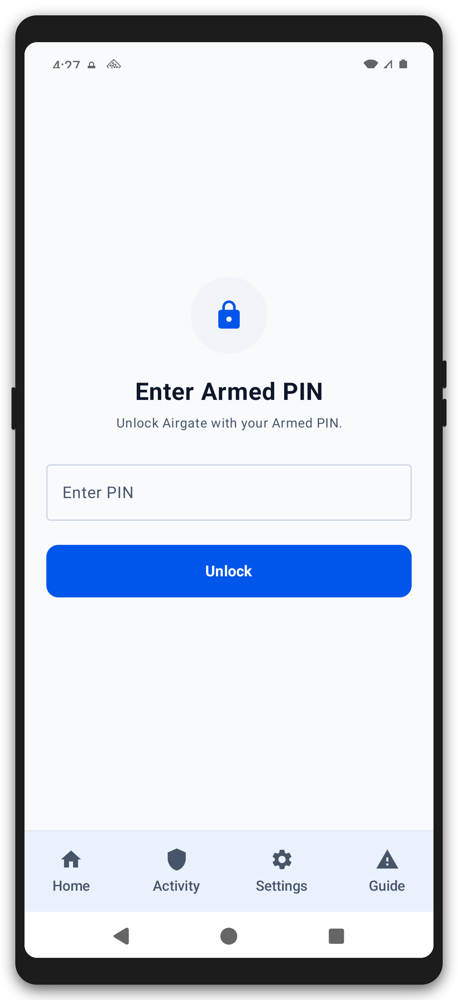

## 2. The dashboard — your threat score

The dashboard is your daily overview and the place you will check most often.

**The threat score meter.** The large hero card shows the accumulated streak against the wipe threshold — here **2 of 3 points**, labelled "ARMED COMPLIANT". The state can be:
- **ARMED COMPLIANT** — protection is on and the score is below the threshold. This is the state you want the phone to be in 99% of the time.
- **ALARM ACTIVE** — a breach added a point but did not reach the threshold yet.
- **COUNTDOWN WIPE / WIPING** — the threshold was reached and the wipe path is running (see step 8).

**The Protection switch.** The "Protection" card is the master on/off for the background watchdog. The app deliberately starts **paused**, so you can review the settings before anything is armed — an alarm must never fire before you have seen what is installed. Tap the switch to arm the watchdog when you are ready. The switch will only arm once a usable Armed PIN is set, the app can post notifications, and Bluetooth detection is allowed (BLUETOOTH_CONNECT on Android 12+) — arming a device whose alarm path could be entirely silent or whose Bluetooth detection is blind is refused (you'll be told which one is missing).

When you'd use it: leave it **on** while the phone sits in storage. Turn it **off** only when you want to silence everything (for example, while you are deliberately working on the phone during setup or recovery). Note that turning it off pauses enforcement but the service still runs.

**The Shield Status card.** This is a live health check of the three defense layers: **Dhizuku Device Owner** authority, **Wireless Transceiver Blockade**, and **USB & ADB Guard**. The wireless row combines readable radio observations with the policy restrictions Airgate controls; the USB row reports policy enforcement rather than guessing from redacted ADB settings or incomplete USB enumeration. Each row reports "Enforced / Blocked / Secured", "Unknown" when Android withholds a required fact, or a list of what is open. Treat "Unknown", "Exposed", and "At Risk" as reasons to investigate before arming.

**Clear Threat Streak.** The red button below the shield card zeroes the score and requires your Armed PIN. You'd use it after a false alarm, or after you have fixed the cause of a breach, to start the count fresh.

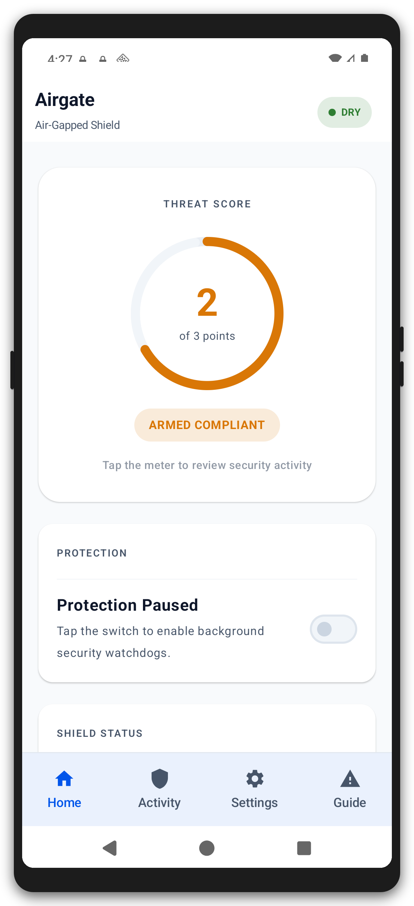

## 3. Security Activity — what happened

The Activity tab answers "why did my score go up?". It shows the current threat score and every violation category that has ever fired, grouped into:

- **ACTIVE CATEGORIES** — the category's scoring group claimed a threat point today, so it is contributing to the current streak.
- **INACTIVE CATEGORIES** — categories that have fired before but are not contributing points right now.

Each category card shows the occurrence count and the most recent human-readable **reason** (for example "Missing: Dhizuku DO status lost or revoked" instead of a bare error code). Tap "What triggers a violation?" at the bottom to jump to the full reference.

When you'd use it: after any alarm, or whenever the score rises, come here first. It is also your tool for diagnosing **false alarms** — for example, the difference between plugging in a *power-only* charger (not a violation) and a *data* cable (a violation) is visible here in the reason text.

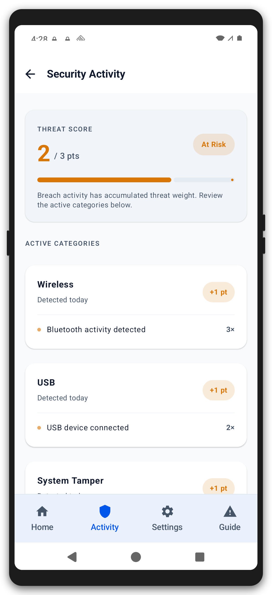

## 4. The Guide — violations catalogue

This is the complete reference of everything the app monitors: every condition, what triggers it, whether it shows the full-screen alarm, and whether it adds a threat point. It is organised into the three scoring groups — **Wireless**, **USB**, and **System Tamper** — and supports a live **search field** plus filter chips ("Alarm screen", "Log only", "Adds point", "No point").

When you'd use it:
- **Before going live** — read the catalogue so you know exactly what will set the phone off. Most of the entries are deliberately strict: airplane mode off, any validated network, a SIM card present, the clock changed.
- **After a breach** — look up the violation to understand what happened and what to fix.
- **To tune false alarms** — the notes column explains the important exceptions, such as "a power-only charger or power bank is not a violation" and "passive Bluetooth proximity events are logged only".

One entry is special: **Wi-Fi transceiver enabled** is **LOG_ONLY** — it appears in the catalogue and in Activity, but it never raises an alarm and never adds a point. It exists purely as an audit trail. Most things that fire an alarm also add a point; the posture/tamper alarm (Device Protection Bypassed, step 6) is off by default until you enable it.

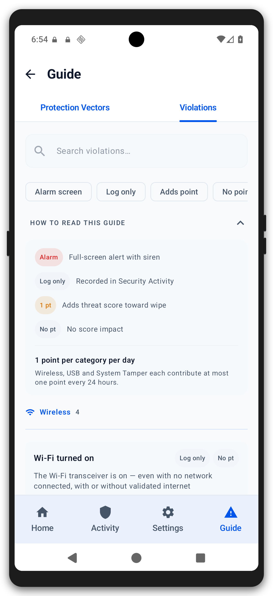

## 5. The Guide — protection vectors

The other Guide tab explains the *defence* side of the shield, as opposed to the *detection* catalogue. It shows the four defense layers and how many are currently active:

- **Network & Connectivity** — monitors real-time path attempts (Wi-Fi, mobile data, VPN, ethernet) so nothing can exfiltrate. If the monitor's own connectivity listener cannot be registered, it retries automatically with backoff and raises a "Network monitor registration failed" violation instead of failing silently — detection never quietly goes dark.
- **Wireless Transceiver Blockade** — enforces airplane mode plus Wi-Fi, Bluetooth, Bluetooth-sharing, tethering, mobile-network, and NFC-beam restrictions. FM radio is not represented by this status row.
- **USB & ADB Prevention** — blocks USB data transfers and ADB debugging so nothing can be pulled off by cable.
- **Self-Defense Audit** — verifies Device Owner authority and pins the app's own signature.

When you'd use it: before arming, to confirm you understand what the app is enforcing, and afterwards as a quick "are all four layers up?" check. The layer list is the conceptual companion to the three-row Shield Status card on the dashboard.

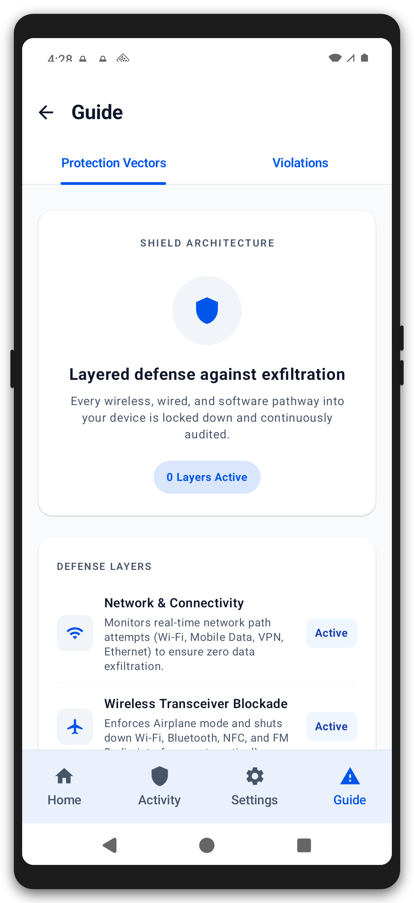

## 6. Security Settings

Settings is a long screen of cards, each owning one concern. Walk through them top to bottom the first time; afterwards you will rarely need more than the top card and the thresholds.

### Required permissions

The phone cannot function without these, so the card turns red until every grant is made:

- **Dhizuku Access** — enables policy enforcement and the wipe via the Device Owner. Tap "Authorize Dhizuku" and confirm in the Dhizuku app.
- **Display over other apps** — the alarm must be able to show over the lock screen. Tap "Allow Overlay".
- **Notifications** — the alarm needs notifications to alert you. Tap "Allow Notifications".
- **Bluetooth detection** — the monitor must be able to read the live Bluetooth state (Android 12+ grants this separately). Without it, arming is refused: a Bluetooth radio switched on or already on could go unnoticed. Tap "Allow Bluetooth Detection".
- **Battery optimization** — *recommended*, not strictly required. Without the exemption the system may put the watchdog to sleep in Doze, and a sleeping watchdog misses breaches. Tap "Allow Exemption".

### Master preferences

- **Enable Watchdog** — the same master switch as the dashboard's Protection card. Armed = on.
- **Paranoid Mode Preset** — one tap applies the strictest posture: wipe threshold 1, safety-net every 1 minute, clock-skew tolerance 1 minute, FRP data included. When you'd use it: any period of elevated risk — transporting the phone, border crossings, customs, or a confrontation where you may be forced to unlock. It makes the phone *more likely* to wipe, so only use it when you fully accept that consequence.
- **Block Debugging Features** — enforces `DISALLOW_DEBUGGING_FEATURES`: hides developer options and USB debugging, and disables ADB. It is verified against the device after toggling, and the status line beneath tells you the truth ("ADB blocked and verified" vs "Enforcement failed"). When you'd use it: keep it **on** for normal cold-storage life. Turn it **off** only when you need to recover the device over ADB — the restriction is cleared immediately so recovery is possible without a factory reset.

### Posture & Tamper alarms

This alarm is **off by default** to avoid wake-up false alarms. It is still detected and logged; enabling it is what makes it raise an alarm and add a point:

- **Device Protection Bypassed** — alarms when Device Owner protection is lost: missing user restrictions, Dhizuku status lost, or the app's signature tampered. When you'd use it: if you want to be woken the instant the phone loses its protection layer, at the cost of possible false alarms. Note that *self-defense failures themselves* always route to the wipe path regardless of this toggle (see step 8).

### PIN Security & Authentication

Explains how your Armed PIN is stored (PBKDF2-HMAC-SHA256, 120,000 rounds — see step 1) and opens **Manage / Reset Armed PIN** (step 7).

### Thresholds & Timers

These sliders tune how trigger-happy the app is. Defaults are shown in parentheses; only change them deliberately.

- **Threat Limit** (3) — the wipe threshold, 1–10 points. Lower = the phone wipes sooner. You'd lower it in high-risk situations; raise it if the phone lives in a low-risk environment and you want tolerance for false alarms.
- **Alarms Per Breach** (3, 2–10) — how many repeated warning notifications a single breach may fire before the app stops nagging.
- **Notification Tail Gap** (12 h, 12 h–7 d) — how long a breach "episode" lasts for re-alarming. After this window, the same condition counts as a new episode and can alert again. You'd widen it if a long-running breach should keep alerting you (for example while you are asleep), or narrow it to avoid noise.
- **Pre-Wipe Grace Window** (0 s, 0–3600 s) — if greater than zero, reaching the threshold starts a **countdown** instead of wiping instantly, giving you a chance to disarm. You'd use a grace window if you want a last-moment escape for false positives, at the cost of giving a genuinely compromised phone extra time.
- **Safety Net Check Cadence** (15 min, 1–60 min) — how often the AlarmManager-driven background audit re-checks radio states and restrictions. Lower = faster detection but more battery; higher = battery savings but a longer blind window.
- **Clock Skew Tolerance** (5 min, 1–60 min) — how much the system clock may move before a "system clock changed" violation fires. You'd raise it if your device's clock drifts.

### Hardening & Wipe Scope

- **Include FRP Reset Data** (off) — also clears Factory Reset Protection data during the wipe. Only relevant if the device uses FRP (e.g. a Google account lock); including it makes the wipe more complete.
- **Device Wipe Scope** — the wipe is always a **Full Factory Reset** of the entire device; there is no profile-only option. Enable "Include FRP Reset Data" above if the device also uses FRP, so the reset clears that too.
- **Self-Tamper Response** — what happens when Device Owner status is lost or the app's signature is tampered: **Instant Wipe** (default, bypasses the streak) or **Alarm + Streak** (warn and score first). Instant Wipe is the zero-tolerance choice for a phone that can be coerced; Alarm + Streak gives you a chance to intervene.

### Developer & Offline Testing

- **Dry-Run Simulation Mode** (on) — the global safety gate. When on, *only* the destructive wipe is simulated; monitoring and policy enforcement (airplane mode, ADB block, restrictions) still run for real. Turning it **off** is gated behind a confirmation dialog that spells out the consequence — with dry-run off, reaching the threshold performs a **real, unrecoverable** factory reset. When you'd use it: leave it **on** while you are still tuning the phone; go live only once you trust the configuration and accept the consequence.
- **Simulation Harness** (visible only while Dry-Run is on) — three one-tap buttons (Wi-Fi, Bluetooth, USB) that inject a synthetic breach (+1 point) so you can watch the full alarm path end-to-end. This is how you test the app safely without touching real radios or cables.

**Done** saves and returns you to the dashboard. **Reset to factory defaults** restores every threshold, timer, and posture choice to factory values (and pauses the watchdog) — useful before handing the phone to someone else or starting over.

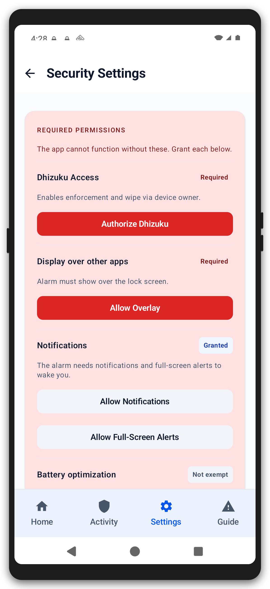

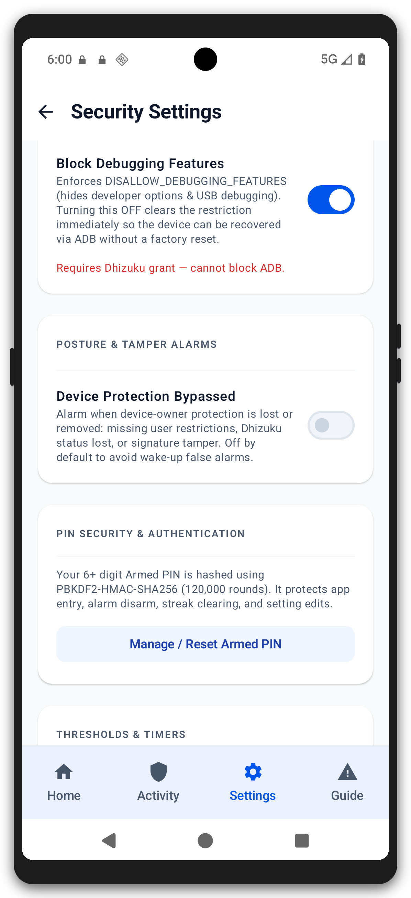

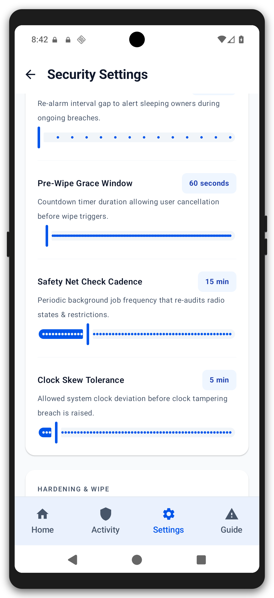

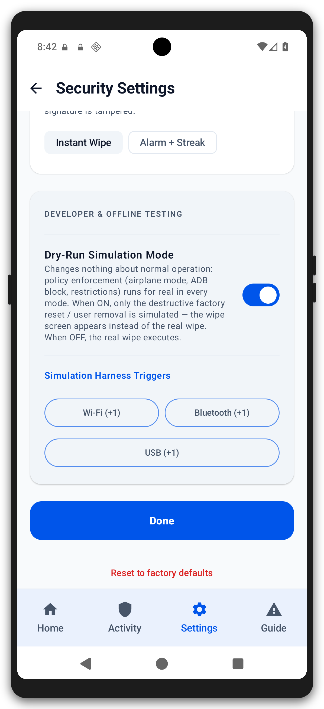

## 7. Change the Armed PIN

From Settings, open **Manage / Reset Armed PIN** to replace your PIN. The old PIN stops working immediately. There is no recovery if you forget it, so store it somewhere safe before changing (the same place you store the wallet's paper seed, ideally).

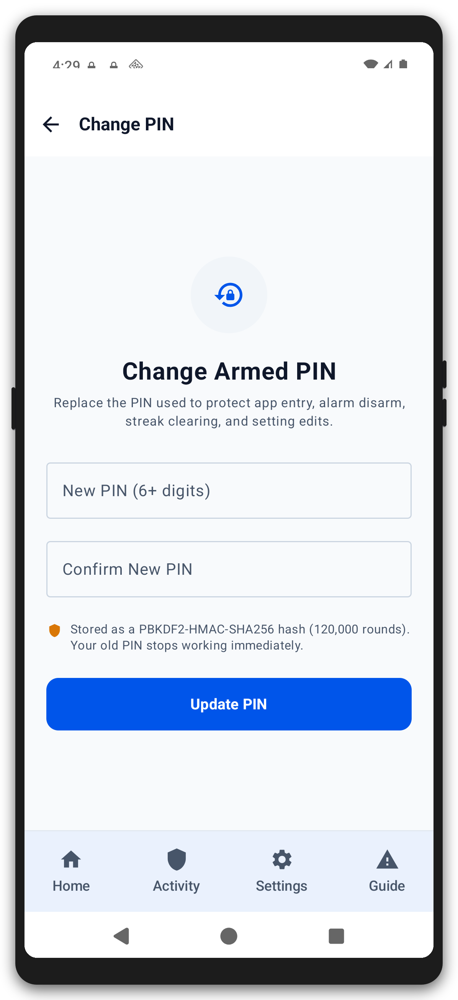

## 8. When the wipe happens — simulated and real

This is the last line of defense, and it is worth understanding exactly how it plays out, because it is the reason the phone is safe to carry under coercion.

**How the path is reached.** When a breach event fires, the app runs reactive hardening (re-asserts airplane mode and the Device Owner restrictions) and, for scoring events, adds a point if the scoring group has not already claimed one today. When the streak reaches the wipe threshold, the wipe path starts. Self-defense failures (Device Owner status lost, signature tampered) skip the streak entirely and go straight to the configured self-tamper response — instant wipe by default, so the phone destroys itself the moment it stops being able to protect itself.

**The alarm.** With no grace window configured, the app shows a full-screen alarm ("Security Breach" / "Wipe Imminent") with sound and vibration. The back button is blocked; the only way out is **Disarm** with your Armed PIN. Disarming cancels a pending grace-window wipe and dismisses the alarm, but deliberately keeps the accumulated streak — PIN-gating a dismissal must not zero the score.

**The wipe screen.** If the wipe executes, the app shows the emergency screen. In **Dry-Run mode** (the default) it is clearly marked **"SIMULATED — NO REAL DATA DESTROYED"**: a rehearsal of the wipe, no data lost. Recovering from a simulated wipe requires your Armed PIN, which resets the threat score and returns you to the dashboard. With **Dry-Run off**, the same screen precedes a **real, non-recoverable** factory reset. There is no undo — that is the point: an adversary who coerces you into unlocking gets a brick, not a wallet.

When you'd experience this: during your own testing (via the simulation harness), and — if you go live with dry-run off — during a genuine, irreversible breach. Make sure your wallet seed is backed up on paper *before* you ever turn dry-run off; the paper seed is the only thing that survives the wipe.

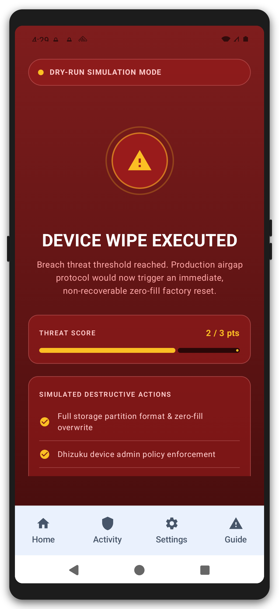

## Security notes

- Airgate never touches the network and holds no `INTERNET` permission — everything runs and stays on the device.
- The wipe path is gated: Dry-Run mode is the default, and turning it off requires a confirmation dialog that spells out the consequence.
- The Armed PIN is stored as a PBKDF2-HMAC-SHA256 hash (120,000 rounds, per-install salt) and is not recoverable.
- The app watches itself: Device Owner authority and its own signature are both monitored, with self-defense failures routed to the wipe path.
- Dark theme screenshots of every screen above live alongside the light ones in `art/screens/` (e.g. `art/screens/mockups/screen-dark.png`).

## Troubleshooting & FAQ

**I plugged in a charger and the alarm went off.** Power-only charging — from a wall adapter or a power bank — is *not* a violation and never triggers the USB detectors. A real data session (MTP/PTP file transfer, ADB, tethering, accessory/MIDI gadget mode, or an ethernet adapter) is. If you used a data cable, use a charge-only cable when charging.

**My threat score went up but I did not do anything.** Open **Security Activity** — it records the category and the reason. Common silent causes: a SIM card present in a slot, the system clock drifting beyond the skew tolerance (step 6), airplane mode being off, or a momentary network registration.

**How do I test the app without wiping my phone?** Keep **Dry-Run Simulation Mode** on, then use the three simulation buttons in Settings → Developer & Offline Testing. Each injects a +1 breach and walks you through the alarm path. Nothing is destroyed.

**The score hit the threshold during a test and the wipe screen is showing. Now what?** You are in Dry-Run, so nothing was destroyed. Enter your Armed PIN to reset the score and return to the dashboard.

**I want to take the phone somewhere risky (travel, border crossing).** Enable **Paranoid Mode Preset** in Settings. It lowers the wipe threshold to 1, tightens every timer (no grace window, 1-minute safety net, 1-minute clock-skew tolerance), includes FRP reset data, and arms the watchdog. Only do this if you fully accept that the phone will wipe on the first serious breach.

**A real wipe happened. Can I get my data back?** No. A real wipe is non-recoverable by design — that is the guarantee that makes the device safe under coercion. The wallet seed on paper is your recovery path.

**Can the app itself be removed or silenced to disable the watchdog?** The app defends itself: if Dhizuku Device Owner status is lost or the app's signature is tampered, the configured self-defense response fires — instant wipe by default. Removing the watchdog *is* the breach.
